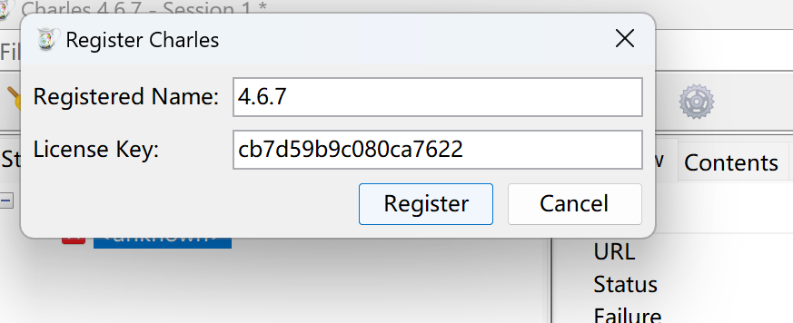

+++
title = "Charles安装激活教程及手机无法安装证书解决方法"
date = "2024-08-01"
tags = ["软件", "工作"]
+++

## 下载安装
- 官方链接：https://www.charlesproxy.com/download/
  
## 破解
- 打开破解网站：https://www.zzzmode.com/mytools/charles/
- 输入任意字符，生成注册码
- Hlep->选择Register Charles
  

- 将之前生成的注册名和注册码输入到对应弹窗内

## 重启
- 可以看到已成功激活啦

## 手机证书安装
- 近期按照charles指示地址，可以安装，但是无法在设置页找到，在网上各种询问解决方法，才发现下载的文件后缀是pro，根本无法识别为描述文件
- 最终发现，由于近期Charles将证书下载地址更换导致。在新网站下载： http://ssl.charles ，设置页就可以正常显示文件，进行安装和信任证书了

